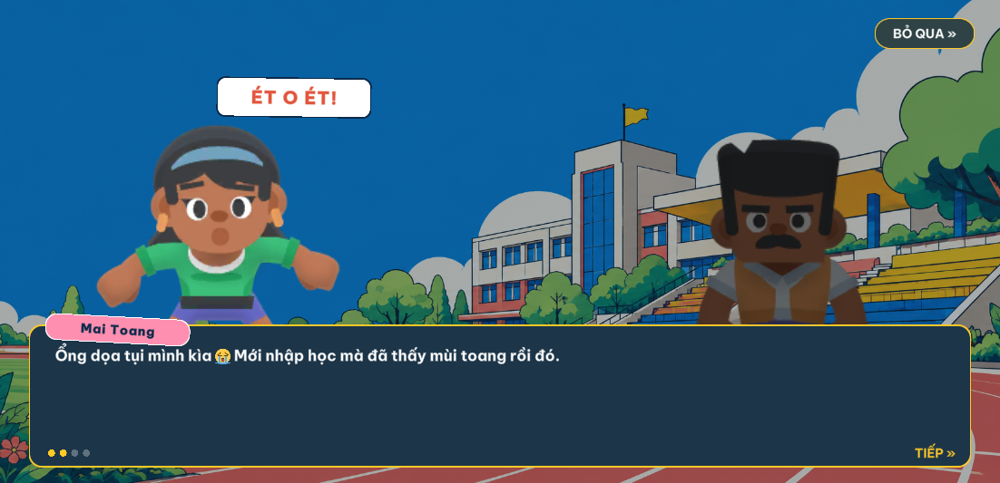
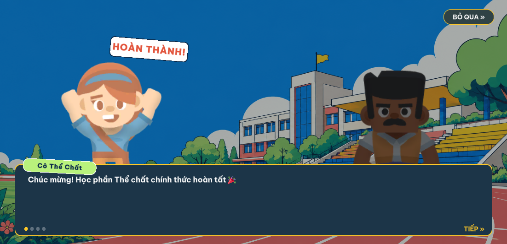

# Student Journey QA

Review fixes were verified against Unity `6000.3.23f1` on Linux on 2026-10-04, in the working tree after `61b1bd3`. The screenshots and Android smoke run below are historical Task 10 evidence and predate these review fixes.

## Review fixes

- Football has no difficulty selector and uses Normal in Journey, Review and FreePlay, including regenerated lesson assets. Learn keeps its goalkeeper disabled; Practice and Exam enable it.
- Pause Restart keeps the selected challenge and attempt mode. Rejected scene loads restore the old attempt in memory and in the save.
- Sprint processes its final frame through `SprintChallengeRules.Tick`, so a finish inside the 14-second limit is judged at the exact deadline.
- Result Retry and supplementary Practice stay available after a save/start failure, with a visible error and no extra life spent.
- Authored Map path segments are reused on rebinding. Lesson objective/status copy uses at least 16-point text. Unsupported arrow/checkmark glyphs use plain Vietnamese copy.

## Automated checks

Initial regressions for the four review findings failed before the fixes; the focused set then passed 15/15. The additional rejected-load restart regression also failed before its rollback fix and then passed.

| Suite | Passed | Failed | Skipped | XML |
|---|---:|---:|---:|---|
| EditMode | 608/611 | 0 | 3 | `Builds/TestResults/journey-review-edit-final3.xml` |
| PlayMode | 239/239 | 0 | 0 | `Builds/TestResults/journey-review-play-final3.xml` |

EditMode uses an ALSA null output for headless ProjectConfigurator audio reinitialization. PlayMode uses the host Pulse/PipeWire output for a real audio clock; an unpaced null output distorted DSP timing. `AudioGameplayTests` explicitly saves, disables and restores Unity Editor master mute. Actual scene mix peaks in the final full run were Sprint 0.393268, Volleyball 0.401565 and Football 0.152914, above the unchanged 1E-05 threshold.

The only EditMode skips are the existing named `ChallengeSequenceTests`: `Controller_ActivatesAuthoredCueAndCounterplayAdapter`, `Controller_RequestsRetryOnceWithoutChangingLivesOrMutatingTheSession`, and `NonFiniteProgress_CannotAdvanceOrCompletePunishment`. The test runner returns nonzero for these ignored tests; XML confirms zero failures.

`BootstrapToSummaryUsesAllNineRealControllersAndPersistsCompletion` loads Bootstrap, starts a new game, traverses Map and all nine minigame scenes, receives real controller results, persists receipts, and restores completed progress. `VolleyballFiveFailuresRequireFreshPracticeAndKeepSprintPassed` drives real exam failures and fresh supplementary practice, preserving Sprint completion and restoring five attempts. These tests use deterministic inputs and controlled Volleyball court positions. Soccer input calls rules directly, and controller time is advanced explicitly; they do not establish UI touch acceptance or device frame timing.

Independent code review caught a builder/asset Normal mismatch, which was fixed and covered by `RegeneratedFootballLessonsKeepNormalAndLearnKeepsKeeperOff`. The follow-up review found no further actionable defect in the focused fixes.

## Visual captures

Historical captures were inspected at the Editor viewport's available `1088x503` resolution. These are static Editor images; they do not establish touch interaction, Android safe-area, or device rendering.

| Capture | Observation |
|---|---|
| `Builds/Screenshots/student-journey/map-start.png` | Course cards and locked states are clear. The lower lesson panel's objective text is small at this viewport size. |
| `Builds/Screenshots/student-journey/sprint-learn.png` | Alternating-tap instruction and both touch controls are visible. |
| `Builds/Screenshots/student-journey/volleyball-learn.png` | Court and joystick/action controls render. Opened directly, this capture has no journey lesson overlay. |
| `Builds/Screenshots/student-journey/soccer-learn.png` | Aim, shot, five-attempt HUD, and tutorial text render clearly. |

Only the available Editor viewport aspect was captured. The requested 16:9, 16:10, 18:9, and 4:3 comparison remains outstanding; the current Editor viewport is fixed at 1088x503. No interaction was simulated by these captures.

## Balance and Android handoff

The three-person novice playtest was not run in this environment. Session duration, attempts per lesson, misunderstanding points, and failure reasons therefore have no player evidence yet.

An Android 17 API 37 AVD (`sdk_gphone16k_x86_64`, 1080x2400 at 420 dpi, 16 KB page-size system image) was used for an x86_64 smoke run. The pre-contrast-fix build launched, New Game and dialogue flow reached the journey map, Sprint Learn accepted alternating left/right touches and completed with score 12, and Continue restored progress after force-stop and relaunch. Unity/Android logcat had no exception, fatal, or crash entries. This was a virtual-device smoke run; it does not establish physical handset behavior, performance, audio quality, or background-resume behavior.

That emulator screenshot also exposed low contrast on lesson labels rendered over white cards: the original `TextPrimary` foreground measured 1.05:1. `JourneyLessonLabelsMeetContrastOnTheirButtonSurface` now asserts a minimum 4.5:1, and the focused EditMode test passed after switching the label to `MutedForeground`. The updated x86_64 APK installed and launched, but ADB disconnected during the follow-up capture, so the corrected map was not visually confirmed on the emulator.

The following historical APKs include the earlier contrast fix and predate the current review fixes. They have not been rebuilt for this patch. `tools/build-apk.sh --arm64 --output-dir Builds/Android --name journey` completed with zero errors and 20 warnings; `Builds/Android/journey-arm64.apk` is 59,800,646 bytes (58 MiB), SHA-256 `0acfa79daf0af4337fa8e9a29f8316d6dde97f08caae1124d6ab656b314011c3`. `tools/build-apk.sh --x86_64 --output-dir Builds/Android --name journey` completed with zero errors and 29 warnings; `Builds/Android/journey-x86_64.apk` is 61,084,901 bytes, SHA-256 `77738f564672232c00594b7bc57ec2d95f3bcb6c3fc59cd96742180a37436b90`. The archives contain their matching `lib/arm64-v8a` and `lib/x86_64` `libil2cpp.so` and `libunity.so` libraries. No physical-device validation is claimed.

## Cốt truyện visual novel (2026-10-05)

Spec: `docs/superpowers/specs/2026-10-05-story-visual-novel-design.md`; plan: `docs/superpowers/plans/2026-10-05-story-visual-novel.md`.

Ảnh chụp trong Unity Editor (Map, Play Mode) bằng `tools/qa-screenshot.sh ... <openDialogue> <dialogueTaps>`:

| Node | Ảnh | Đã kiểm tra |
|---|---|---|
| `opening`, câu 2 (3 lần chạm) |  | Mai Toang đang nói (sáng, mặt hoảng nhìn thẳng), Tân Thủ nghe bên phải (tối), sticker "ÉT O ÉT!", emoji 😭 đúng vị trí trong câu, tag hồng, chấm tiến độ, "TIẾP »" |
| `course_complete`, câu 1 (1 lần chạm) |  | Cô Thể Chất cheer, sticker "HOÀN THÀNH!", emoji 🎉, tag xanh lá |

Ghi chú khi chụp:
- Tư thế `Hurt` dùng sprite `_hit` (mặt hoảng nhìn thẳng) vì cả bốn sprite `_hurt` là ảnh quay lưng.
- Lần chụp đầu tiên ngay sau khi mở Editor có thể hiện emoji thành ô xanh lơ phẳng: đó là placeholder biên dịch shader bất đồng bộ của Unity, không phải lỗi. Chụp một ảnh bỏ đi trước, rồi chụp ảnh thật.
- Chỉ kiểm tra ở viewport Editor (≈1102×533); chưa chụp trên thiết bị Android thật.

Test liên quan (đều pass): `DialogueEmojiTests`, `DialogueTypewriterTests`, `JourneyDialogueValidationTests`, `JourneyDialogueDataTests`, `JourneyEmojiAssetTests`, `JourneyNarrativeTests` (PlayMode, 7 test), `StudentJourneyFlowTests`.
